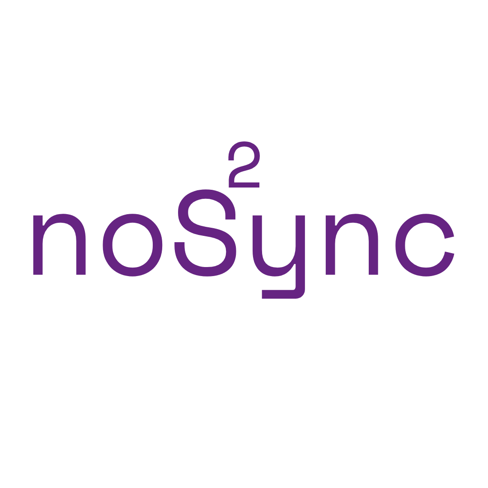

[](https://discord.gg/EvYB9ZgYvV)

### Nos2ync

Nostr sync is a tool that helps you to sync your last `n` tweets with your Nostr account.
Generally it helps you to use Nostr without losing your tweets.

## Install & Usage

Install:
```
cargo install nos2ync
```

Usage:
```
nos2ync ./nos2ync_config.toml
```

## Contribution

Contributions are welcomed!

## License

Nos2ync is under [MIT](./LICENSE) license
